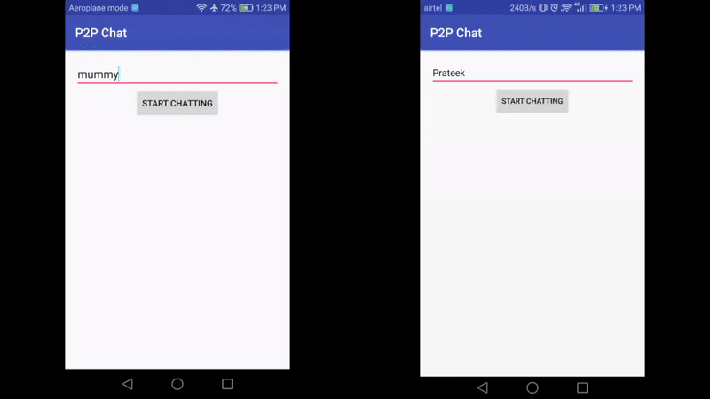

# Near
Near is a P2P library which allows
* Discovery like Android NSD, though with greater reliability and easier-to-use *NearDiscovery* API
* Transfers among clients through an easy-to-use *NearConnect* API

## Sample Usage


Sample app, with the source code [here](app/) is [available on PlayStore](https://goo.gl/kioAiQ).

## NearDiscovery
NearDiscovery takes hostname and a bunch of settings in a builder pattern for the discovery mechanism. A NearDiscovery object allows the following discovery related self-explanatory APIs:
* ```void makeDiscoverable(String hostName);```
* ```void makeNonDiscoverable();```
* ```void startDiscovery();```
* ```void stopDiscovery();```
* ```Set<Host> getAllAvailablePeers();```
* ```boolean isDiscoverable();```
* ```boolean isDiscovering();```

Here's how the NearDiscovery object is created
```
private NearDiscovery mNearDiscovery = new NearDiscovery.Builder()
                .setContext(this)
                .setDiscoverableTimeoutMillis(DISCOVERABLE_TIMEOUT_MILLIS)
                .setDiscoveryTimeoutMillis(DISCOVERY_TIMEOUT_MILLIS)
                .setDiscoverablePingIntervalMillis(DISCOVERABLE_PING_INTERVAL_MILLIS)
                .setDiscoveryListener(getNearDiscoveryListener(), Looper.getMainLooper())
                .build();
```
The Looper passed as the 2nd param of NearDiscovery.Builder.setDiscoveryListener() is for the thread on which the listener, the 1st param, should be called.
Sample listener:
```
    @NonNull
    private NearDiscovery.Listener getNearDiscoveryListener() {
        return new NearDiscovery.Listener() {
            @Override
            public void onPeersUpdate(Set<Host> hosts) {
                // Handle updates of peer list here - some peer might have got removed if it wasn't reachable anymore or some new peer might have been added
            }

            @Override
            public void onDiscoveryTimeout() {
                // This is called after the discovery timeout (specified in the builder) from starting discovery using the startDiscovery()
            }

            @Override
            public void onDiscoveryFailure(Throwable e) {
                // This is called if discovery could not be started
            }

            @Override
            public void onDiscoverableTimeout() {
                // This is called after the discoverable timeout (specified in the builder) from becoming discoverable by others using the makeDiscoverable()
            }
        };
    }
```
NearDiscovery.Builder.setDiscoverablePingIntervalMillis() tells the interval at which each client broadcasts about its existence. The NearDiscovery.Listener.onPeersUpdate() gets called even if a peer is deemed stale, i.e. it's last broadcast received was more than twice the discoverable-ping-interval ago.

The discovery mechanism takes place in background services which do not hold any wakelocks.
## NearConnect
A NearConnect object provides P2P mechanism with the following self-explanatory APIs:
* ```long send(byte[] bytes, Host peer);```
* ```void startReceiving();```
* ```void stopReceiving(boolean abortCurrentTransfers);```
* ```Set<Host> getPeers();```
* ```boolean isReceiving();```

NearConnect.startReceiving() only tells to start *listening* for any incoming transfers, similarly NearConnect.isReceiving() only tells if the client is listening for transfers or not and *not* if any data is currently being received.
Here's how the NearConnect object is created:
```
        private NearConnect mNearConnect = new NearConnect.Builder()
                .fromDiscovery(mNearDiscovery)
                .setContext(this)
                .setListener(getNearConnectListener(), Looper.getMainLooper())
                .build();
```
The NearDiscovery object passed in NearConnect.Builder.fromDiscovery() is only to get the list of peers from. Peers can be explicitly provided as well:
```
        private NearConnect mNearConnect = new NearConnect.Builder()
                .forPeers(peers) // Set<Host> peers
                .setContext(this)
                .setListener(getNearConnectListener(), Looper.getMainLooper()).build();
```
Again, the NearConnect.Builder.setListener() takes the Listener as the 1st argument and the Looper on which to call the Listener as the 2nd argument. Here's what the Listener looks like:
```
    @NonNull
    private NearConnect.Listener getNearConnectListener() {
        return new NearConnect.Listener() {
            @Override
            public void onReceive(byte[] bytes, final Host sender) {
            // Process incoming data here
            }

            @Override
            public void onSendComplete(long jobId) {
            // jobId is the same as the return value of NearConnect.send(), an approximate epoch time of the send
            }

            @Override
            public void onSendFailure(Throwable e, long jobId) {
            // handle failed sends here
            }

            @Override
            public void onStartListenFailure(Throwable e) {
            // This tells that the NearConnect.startReceiving() didn't go through properly.
            // Common cause would be that another instance of NearConnect is already listening and it's NearConnect.stopReceiving() needs to be called first
            }
        };
    }
```
It's required to stop listening on a previous instance of NearConnect (using NearConnect.stopReceiving()) so as to start listening on another instance (by using NearConnect.startReceiving()).
This is because the same server port is used in each instance (<- could be made configurable later if deemed necessary).

on startReceiving(), and on send() partial wakelocks are held and released on stopReceiving() and on send completion/failure respectively.

***Note:* NearConnect should work even outside of a local network, except across NAT firewalls.**

## Getting Started
Add jitpack.io to your root build.gradle
```
allprojects {
    repositories {
        ...
        maven { url "https://jitpack.io" }
    }
}
```
Then add the dependency in your project build.gradle
```
dependencies {
    ...
    compile 'com.github.adroitandroid:Near:v1.1'
    ...
}
```
You can find the latest version [here](https://github.com/adroitandroid/Near/releases/latest/).

## Limitations
- File transfers aren't easy yet. Services are background, API to take notification to start them in foreground, and listener methods to publish updates are on the TODO list.
- Current Min SDK is 21. Pulling it down, after testing, is again on the TODO list.

## License

View full license [here](LICENSE). In short:

> The MIT License is a permissive license that is short and to the point. It lets people do anything they want with your code as long as they provide attribution back to you and don’t hold you liable.
